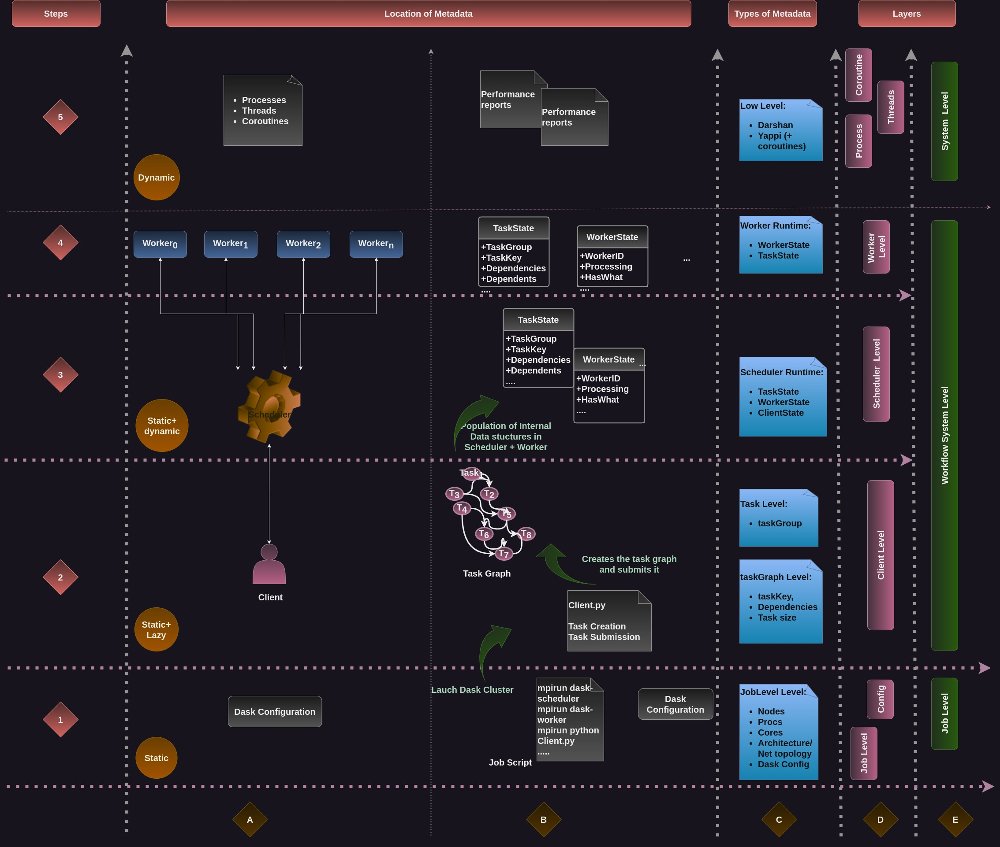

# Metadata Collection from Dask Workloads: 

## Dask Workflow Example:
The [image processing notebook](Notebooks/image-processing.ipynb) from [Dask examples](https://github.com/dask/dask-examples/) contains an image processing pipeline. In this version, we use the distributed scheduler of Dask rather rath plain Dask. The notebook has been edited for this work purpose: Metadata Collection from Dask Distributed Workflows. 

The Screenshot video in this repo shows the Dashboard of a Dask Cluster running the image processing notebook. we can see how the workflow progresses, the distribution of the tasks over threads, the occupancy of the workers, and so on. 

More documentation on the performance profiling and Dask Dashboard are [here](https://docs.dask.org/en/stable/debugging-performance.html).

## Dask Metadata Data Map
In a typical Dask workload, several metadata can be collected. These metadata can be represented in several layers ( Job level, Dask configuration, Task graph, Task, Runtime …) 
that we present in the following map. 

Fig. Metadata Map in Dask Workloads. 

There are two dimensions in this map. The time dimension is represented by steps (1-5) and abstraction levels (A-E).

Column [A-B-C] shows the evolution of a typical Dask workflow, which metadata we can get at each step, and their location.
1. Step 1: Configuration and launching the Dask Cluster
    - Dask internal configuration: https://docs.dask.org/en/latest/configuration.html
    - Job configuration: nodes, processes, cores
    - The data collected at this step is static and can be retrieved from the different files (job script, [distributed.yaml](https://docs.dask.org/en/latest/configuration.html))
2. Step 2: Task creation and submission. It happens at the client level
    - usually, it is a Python script describing the workflows.
    - The metadata can be retrieved from the script, it is static, and lazy (tasks are created and then submitted to the cluster to be run later) 
NB: The task graph may be optimized by Dask, check [Phases of a coputation](https://docs.dask.org/en/latest/phases-of-computation.html)
3. Step 3: The population of internal Dask structures:
    - There are several classes in the [scheduler](https://distributed.dask.org/en/stable/scheduling-state.html), and each of them keeps the state of a given entity ([TaskState](https://distributed.dask.org/en/stable/scheduling-state.html#task-state), [WorkerState](https://distributed.dask.org/en/stable/scheduling-state.html#worker-state), [ClientState](https://distributed.dask.org/en/stable/scheduling-state.html#client-state) …)
    - Here we have both static and dynamic data: 
        * Static: tasks, and their dependencies 
        * Dynamic: the transition of the tasks and their evolution (it happens at runtime):
            . Where a task is running 
            . The story of a task (it’s transitions) 
4. Step 4-5: Task execution:
    - Step 4: Task reception from the scheduler 
        - metadata we can get from the worker data structures 
            * TaskState to track task progress 
            * WorkerState …
   - Step 5: metadata from Darshan/Yappi  reports..
        - [Yappi](https://github.com/sumerc/yappi) Reports (that take into account asyncio stuff)
        - [Darshan](https://www.mcs.anl.gov/research/projects/darshan/) Reports

The Column [C-D-E] represents a categorization of metadata and their location:
  + E: Higher level categories (Job level, Workflow system level, System level)
  + D: lower level categories (job, config, client, scheduler, worker, process, thread, coroutine) Level
  + C: Locations
