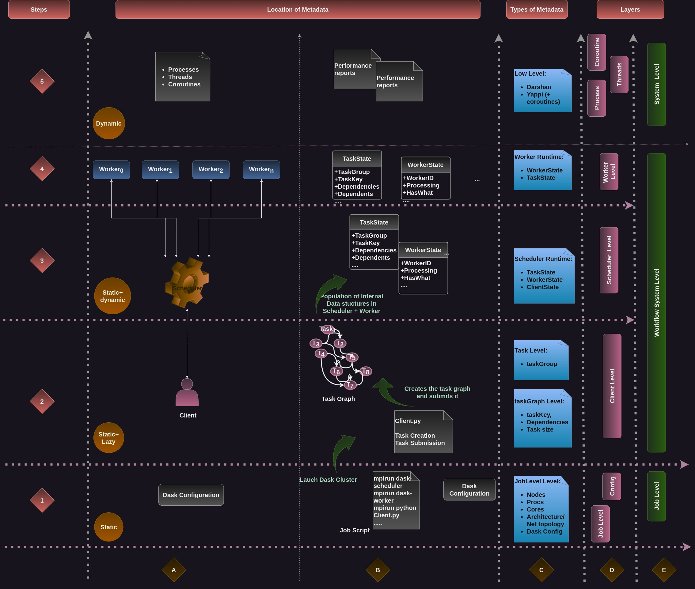

# Metadata Collection: 

In a typical Dask workload, several metadata can be collected. These metadata can be represented in several layers ( Job level, Dask configuration, Task graph, Task, Runtime …) 
that we present in the following map. 

There are two dimensions in this map. The time dimension is represented by steps (1-5) and abstraction levels (A-E).

Column [A-B-C] shows the evolution of a typical Dask workflow, which metadata we can get at each step, and their location.
1. Step 1: Configuration and launching the Dask Cluster
    - Dask internal configuration: https://docs.dask.org/en/latest/configuration.html
    - Job configuration: nodes, processes, cores
    - The data collected at this step is static and can be retrieved from the different files (job script, distributed.ymal)
2. Step 2: Task creation and submission. It happens at the client level
usually it is a Python script describing the workflows.
The metadata can be retrieved from the script, it is static, and lazy (tasks are created and then submitted to the cluster to be run later) 
NB: The task graph may be optimized by Dask
3. Step 3: The population of internal Dask structures:
    - There are several classes in the scheduler, and each of them keeps the state of a given entity (TaskState, WorkerState, ClientState …)
    - Here we have both static and dynamic data: 
        * Static: the dependencies between tasks 
        * Dynamic: the transition of the tasks and their evolution (it happens at runtime):
Where a task is running 
The story of a task (it’s transitions) 
4. Step 4-5: Task execution:
    - Step 4: Task reception from the scheduler 
    - metadata we can get from the worker data structures 
        * TaskState
        * WorkerState …
5. Step 5: metadata from Darshan/Yappi  reports..
    - Yappi Reports (that take into account asyncio stuff)
    - Darshan Reports

The Column [C-D-E] represents a categorization of metadata and their location:
  + E: Higher level categories (Job level, Workflow system level, System level)
  + D: lower level categories (job, config, client, scheduler, worker, process, thread, coroutine) Level
  + C: Locations
